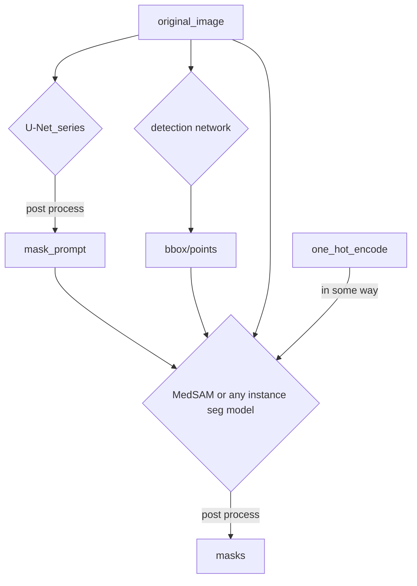
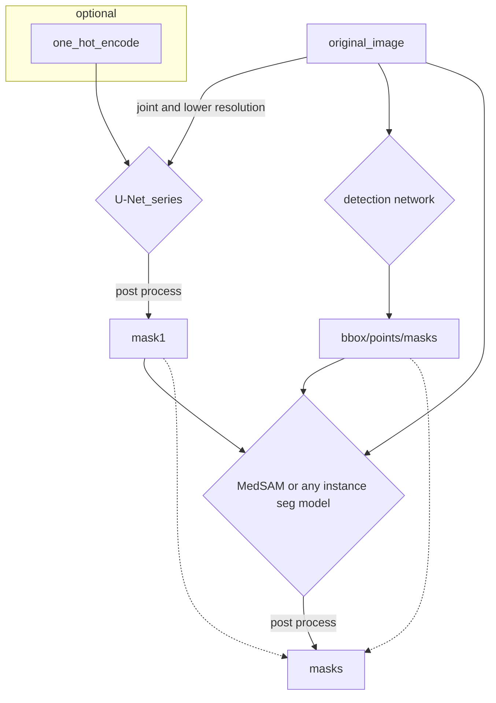

## paradigm#1

## paradigm#2

One approach to combine the masks generated by multiple segmentation networks is to use a technique called "ensemble learning". Ensemble learning involves combining the outputs of multiple models to improve the overall performance.

Here are a few ways you could use ensemble learning to combine the masks generated by your segmentation networks:

1. Averaging: You could simply average the masks generated by each network to create a final mask. To do this, you would sum the pixel values of each mask and divide by the number of masks.

2. Weighted averaging: You could also use weighted averaging, where you assign each network a weight based on its performance on a validation set. The weights could be proportional to the accuracy of each network, or you could assign more weight to the networks that perform better on certain types of images.

3. Majority voting: Another approach is to use majority voting, where you take the pixel-wise majority of the masks generated by each network. This means that if a pixel is labeled as "foreground" by the majority of the networks, it will be labeled as such in the final mask.

4. Conditional random field (CRF): Finally, you could use a CRF to refine the output of the segmentation networks. A CRF is a graphical model that can take into account the spatial relationships between pixels and refine the segmentation based on this information. You would use the masks generated by the segmentation networks as input to the CRF and the CRF would output a final mask.

It's worth noting that the best approach will depend on the specifics of your problem and the performance of your segmentation networks. You may need to experiment with different approaches to find the one that works best for your data.

---

zoom and focus approach.

you can perform semantic segmentation at larger image (e.g. fuse 2x2 tiles) and lower resolution, etc

[focus]  
then generate prompts (potential candiates) from the above results.  
input each prompt (e.g. random pixel in the above prediction mask) into e.g. SAM to get instance segmentation  
here, you can use larger image resolution

---

one important tip:

- boundary object are hard to segment. you can improve results by using context from neighbour tile